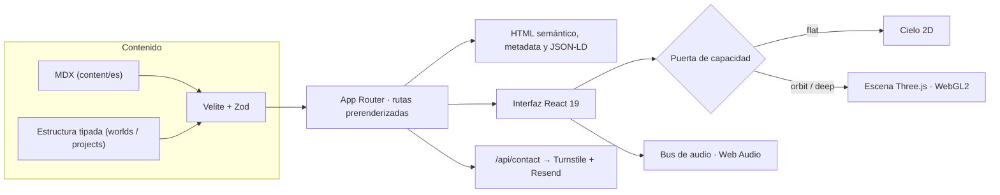

<div align="center">

# Jonás Orbit

**Portafolio de Jonás Javier Encarnación — desarrollador full-stack y diseñador UX/UI**

Un sistema estelar navegable donde cada cuerpo es una parte de mi trabajo.
Hecho con Next.js, React y una escena WebGL2 escrita a mano.

[**🌐 jonasjavier.dev**](https://jonasjavier.dev) ·
[Proyectos](https://jonasjavier.dev/es/proyectos) ·
[Contacto](https://jonasjavier.dev/es/contacto) ·
[LinkedIn](https://www.linkedin.com/in/jonas-javier-247b50425)

[](https://github.com/JonasJavier/jonas-orbit-v3/actions/workflows/ci.yml)


<br/>

<a href="https://jonasjavier.dev"></a>

</div>

> **In English —** Jonás Orbit is the portfolio of Jonás Javier Encarnación, a
> full-stack developer and UX/UI designer from the Dominican Republic. The home
> page is a hand-built WebGL2 star system (a ray-marched black hole plus five
> bodies) where every body opens a real, server-rendered route: about me,
> education, projects, creative work, 3D experiments and contact. The 3D scene
> is a progressive enhancement: every page ships its full content as HTML, works
> without JavaScript, and passes Lighthouse accessibility, best-practices and
> SEO at 100. Built with Next.js 16, React 19, TypeScript, Three.js and Velite,
> tested with Vitest and Playwright, deployed on Railway.

---

## Índice

- [Recorre el sitio](#recorre-el-sitio)
- [Casos de estudio](#casos-de-estudio)
- [Lo que hay debajo](#lo-que-hay-debajo)
- [Arquitectura](#arquitectura)
- [Stack](#stack)
- [Calidad](#calidad)
- [Ejecutarlo en local](#ejecutarlo-en-local)
- [Estructura del repositorio](#estructura-del-repositorio)
- [Autor](#autor)
- [Licencia](#licencia)

## Recorre el sitio

La portada es un mapa. Cada cuerpo es una sección con su propia ruta, su propio
lenguaje visual y su propio HTML.

| Cuerpo | Sección | Qué encuentras |
| --- | --- | --- |
| 🕳️ Gargantúa | [Sobre mí](https://jonasjavier.dev/es/sobre-mi) | Quién soy: raíces, gente y lo que me mueve |
| 🌊 Miller | [Formación](https://jonasjavier.dev/es/formacion) | Estudios, certificados y un océano en WebGL2 |
| 🛰️ Endurance | [Proyectos](https://jonasjavier.dev/es/proyectos) | Una mesa de ingeniería con cinco casos completos |
| 🪨 Edmunds | [Creatividad](https://jonasjavier.dev/es/creatividad) | Fotografía y diseño en una galería 3D |
| 🧊 Tesseracto | [Experimentos](https://jonasjavier.dev/es/experimentos) | Un observatorio para mirar de cerca cada objeto 3D |
| 🚀 Ranger | [Contacto](https://jonasjavier.dev/es/contacto) | Formulario, correo, WhatsApp y LinkedIn |

<table>
  <tr>
    <td width="50%"></td>
    <td width="50%"></td>
  </tr>
  <tr>
    <td></td>
    <td></td>
  </tr>
</table>

## Casos de estudio

Cinco productos reales, cada uno con su problema, sus decisiones de diseño, su
ruta de ingeniería y enlaces a lo que está en línea.

| Proyecto | Qué es | Stack principal |
| --- | --- | --- |
| [**OMSTA**](https://jonasjavier.dev/es/proyectos/omsta) | ERP en producción para una agencia de viajes, con app móvil | Django · DRF · PostgreSQL · React Native · Expo |
| [**Izak's Photos**](https://jonasjavier.dev/es/proyectos/izaks-photos) | Sitio bilingüe de un estudio de fotografía (demostración) | React · Django REST · Railway |
| [**Wikiverse**](https://jonasjavier.dev/es/proyectos/wikiverse) | Enciclopedia con revisiones inmutables y búsqueda de texto completo | Django · React · PostgreSQL |
| [**Network 3.0**](https://jonasjavier.dev/es/proyectos/network-3-0) | Red social con feed por cursor y JWT con rotación | Django REST · React · TypeScript |
| [**Delicaté 4.0**](https://jonasjavier.dev/es/proyectos/delicate-4-0) | E-commerce artesanal con pedidos por WhatsApp | Django REST · React 19 |

## Lo que hay debajo

**El contenido va antes que el canvas.** Cada ruta se prerenderiza con su texto
real. Nombre, rol, CV y los seis destinos existen como HTML sin JavaScript. El
canvas es `aria-hidden`, va detrás y nunca es el elemento LCP. Un lector de
pantalla, Googlebot y una conexión lenta reciben el mismo sitio.

**La escena 3D se adapta al equipo.** Una puerta de capacidad decide entre tres
niveles (`flat`, `orbit`, `deep`) según WebGL2, el tipo de GPU, la memoria y la
red. En equipos modestos se queda en un cielo 2D completo, sin castigar a nadie
por no tener una GPU potente.

**Gargantúa se calcula por *ray marching*.** El agujero negro no es una imagen:
un shader traza la luz curvada alrededor del horizonte, con acumulación
temporal y *bloom*. Los programas se compilan en paralelo
(`KHR_parallel_shader_compile`) antes del primer fotograma para no bloquear el
hilo principal al llegar.

**La cámara no tiene controlador.** La pose es una función pura de la ruta
(`cameraPose = f(ruta)`). No hay `OrbitControls` ni scroll acoplado. Las
transiciones van guionadas, se pueden interrumpir y tienen tiempo máximo: la
animación nunca decide la navegación.

**Movimiento y sonido bajo control.** Un único interruptor apaga todo el
movimiento y otro todo el audio (un solo bus de Web Audio, con efectos
sintetizados en código). Sus estados se leen en reposo, sin depender de una
animación, y el audio no suena antes del primer gesto del visitante.

**SEO de verdad.** Metadatos y Open Graph propios por ruta, tarjetas de 1200 ×
630, `sitemap.xml`, `robots.txt`, canonical, y JSON-LD con `Person`, `WebSite`,
`BreadcrumbList` y `CreativeWork` para cada caso y cada objeto del Observatorio.

**Seguro por defecto.** Content-Security-Policy y cabeceras de seguridad en
`next.config.ts`, formulario protegido con Cloudflare Turnstile, límite de
envíos por IP y secretos solo en el entorno del servidor.

## Arquitectura



- **Una sola fuente de identidad.** Estructura y prosa se unen por `WorldId`,
  nunca por el slug de la URL; el significado vive en el MDX.
- **Un solo pipeline de contenido.** Velite valida cada campo con Zod y rompe el
  build ante un dato incoherente (una captura sin publicar, un orden repetido,
  un título SEO demasiado largo).
- **Imágenes preparadas en el build.** Las capturas se sirven como escaleras
  WebP con `srcset`, dimensiones medidas y una tarjeta JPEG para compartir.

## Stack

| Capa | Tecnología |
| --- | --- |
| Aplicación | Next.js 16 (App Router), React 19, TypeScript 5 |
| Gráficos | Three.js, WebGL2, GLSL propio, Canvas 2D |
| Estilos | CSS moderno y Tailwind CSS 4 |
| Contenido | Velite (MDX) + Zod |
| Audio | Web Audio API |
| Pruebas | Vitest, Testing Library, Playwright, Lighthouse CI |
| Calidad | ESLint, Knip, TypeScript estricto |
| Producción | Railway (`next start`) · compatibilidad con Cloudflare Workers vía OpenNext |

## Calidad

| | |
| --- | --- |
| ✅ **550+** pruebas unitarias y de componentes | ✅ **130+** escenarios end-to-end (Chromium escritorio y móvil, más Firefox y WebKit) |
| ✅ Lighthouse móvil: **Accesibilidad 100 · Buenas prácticas 100 · SEO 100** | ✅ Knip en CI: cero archivos, exports o dependencias huérfanas |
| ✅ Versiones exactas y auditoría de dependencias | ✅ HTML útil sin JavaScript en todas las rutas |

La CI ejecuta lint, tipos, Knip, pruebas, build, las rutas del Worker de
Cloudflare, Playwright en tres motores, Lighthouse y la comprobación de enlaces
con Lychee. Un push a `main` no publica: Railway construye la rama
`production`, que solo avanza a commits que ya pasaron todos los gates, y enruta
tráfico cuando `/api/health` responde 200.

## Ejecutarlo en local

> Se permite clonarlo para evaluarlo de forma privada; ver [Licencia](#licencia).

Requisitos: Node.js 24 ([`.nvmrc`](.nvmrc)) y npm 11.

```bash
npm ci
cp .env.example .env.local
npm run dev
```

| Comando | Qué hace |
| --- | --- |
| `npm run dev` | Servidor de desarrollo (compila el contenido antes) |
| `npm run check` | Lint + tipos + Knip + pruebas + build: lo mismo que la CI |
| `npm run test:e2e` | Playwright; requiere `npm run build` previo |
| `npm run content` | Compila y valida el contenido con Velite |

En Windows con VBS/HVCI, `workerd` puede no arrancar; el ejemplo de entorno
trae `CF_DEV_CONTEXT=off` para que Next.js lea las variables de `process.env`.
Las variables de producción viven en el servicio de Railway, nunca en el
repositorio: [`.env.example`](.env.example) documenta cada una.

## Estructura del repositorio

```text
app/          rutas, metadata, sitemap, robots y endpoints
components/   interfaz por destino y escenas 3D (components/scene)
content/      estructura tipada + prosa MDX localizada
lib/          lógica compartida: cámara, audio, capacidad, SEO
e2e/          flujos críticos en navegador (Playwright)
public/       recursos optimizados que sirve la aplicación
tools/        captura, medición y preparación de medios
docs/         plan, decisiones, diseño y revisiones
infra/        infraestructura como código
```

Los originales (fotografías, piezas de diseño, capturas en PNG y kits de
evidencia de cada proyecto) no se versionan: viven fuera del repositorio y
`tools/prepare-*.mjs` genera desde ellos lo que se publica en `public/`.

La documentación de decisiones empieza en [`docs/README.md`](docs/README.md) y
el [registro de decisiones](docs/registro-de-decisiones.md).

## Autor

**Jonás Javier Encarnación** — desarrollador full-stack y diseñador UX/UI,
Santo Domingo, República Dominicana. Disponible para empleo y proyectos.

- 🌐 [jonasjavier.dev](https://jonasjavier.dev)
- 💼 [LinkedIn](https://www.linkedin.com/in/jonas-javier-247b50425)
- ✉️ [jonasjavier.dev@gmail.com](mailto:jonasjavier.dev@gmail.com)
- 📄 CV en [español](https://jonasjavier.dev/cv/jonas-javier-cv-es.pdf) · [English](https://jonasjavier.dev/cv/jonas-javier-cv-en-ats.pdf)

## Licencia

**Todos los derechos reservados.** Este repositorio es público para que el
código y el proceso puedan leerse y evaluarse, pero **no es código abierto**: no
se permite copiar, modificar, reutilizar ni desplegar el código, el diseño o el
contenido sin permiso por escrito. Las condiciones completas, en español e
inglés, están en [`LICENSE`](LICENSE).

Las dependencias de terceros conservan sus propias licencias.
