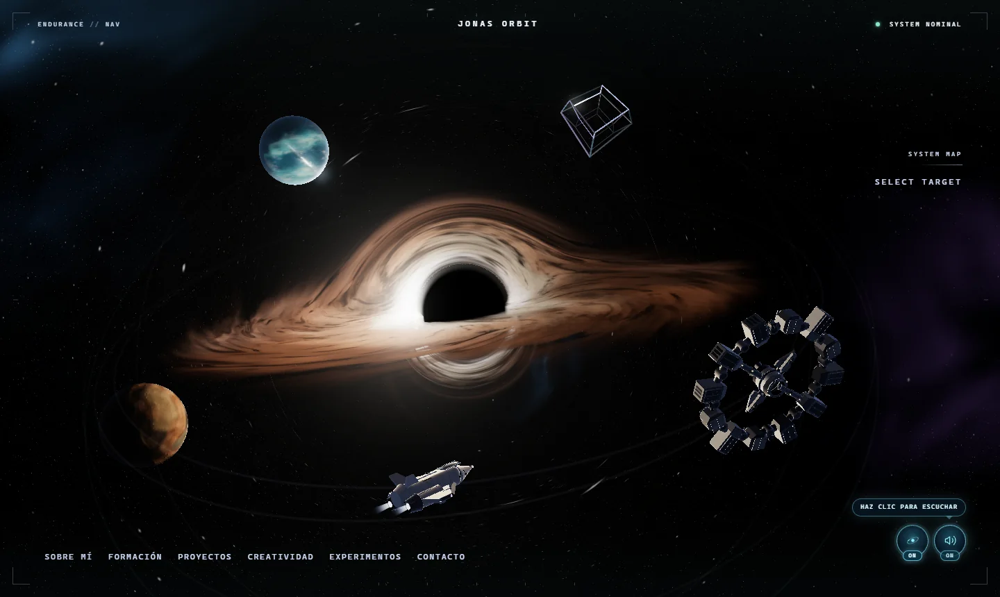
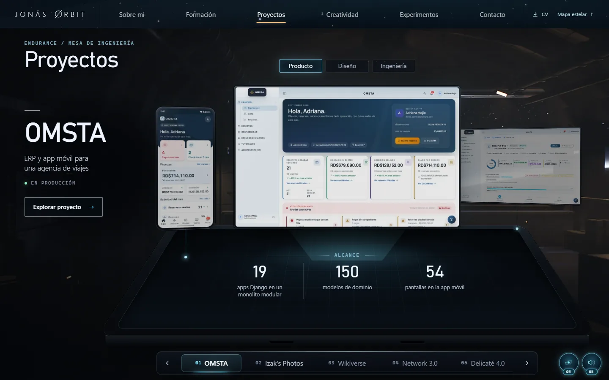
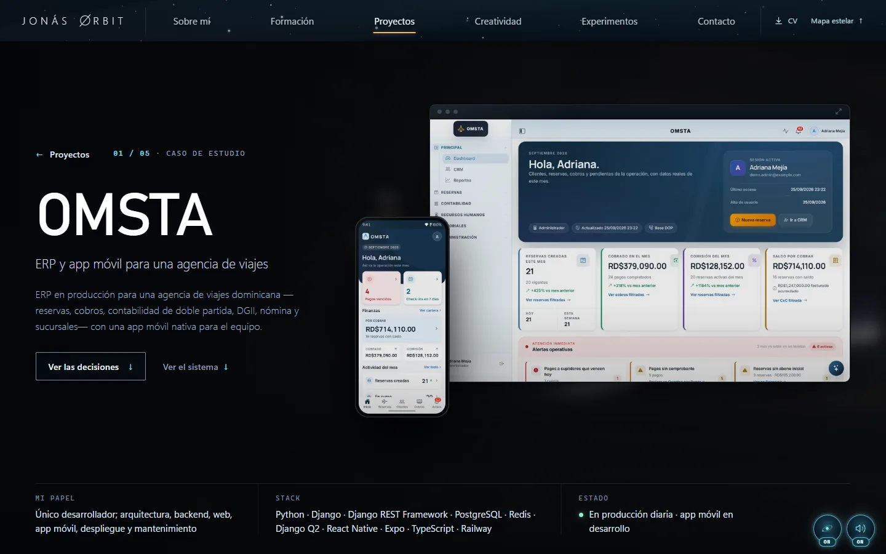
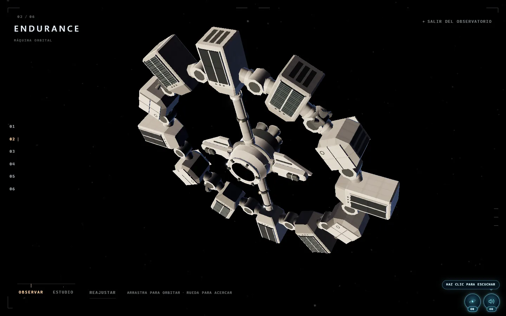
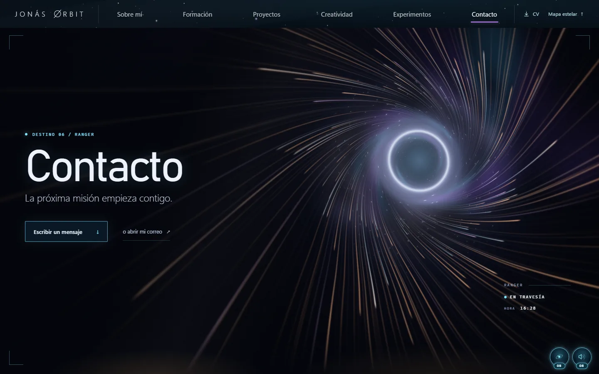
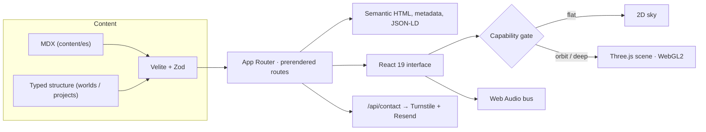

<div align="center">

# Jonás Orbit

**The interactive portfolio of Jonás Javier Encarnación — full-stack developer and UX/UI designer**

A navigable star system where each destination tells a different part of my story. Built with Next.js, React, and a hand-crafted WebGL2 scene.

[**🌐 Explore the live site**](https://jonasjavier.dev) ·
[Projects](https://jonasjavier.dev/es/proyectos) ·
[Contact](https://jonasjavier.dev/es/contacto) ·
[LinkedIn](https://www.linkedin.com/in/jonas-javier-247b50425/)

[](https://github.com/JonasJavier/jonas-orbit-v3/actions/workflows/ci.yml)


<br/>

<a href="https://jonasjavier.dev"></a>

</div>

> **Language note:** The main guides are in English; the historical design and decision records retain their original Spanish text. The live portfolio and its editorial MDX content currently use Spanish routes under `/es`. Route labels below use the actual site paths.

## Contents

- [Explore the site](#explore-the-site)
- [Featured case studies](#featured-case-studies)
- [How it works](#how-it-works)
- [Architecture](#architecture)
- [Technology](#technology)
- [Quality and verification](#quality-and-verification)
- [Run locally](#run-locally)
- [Repository map](#repository-map)
- [Documentation](#documentation)
- [Author and license](#author-and-license)

## Explore the site

The home page is a map. Each body leads to its own server-rendered route, visual language, and content.

| Body | Destination | What you will find |
| --- | --- | --- |
| 🕳️ Gargantua | [About me](https://jonasjavier.dev/es/sobre-mi) | My background, roots, and the people and ideas that shape my work |
| 🌊 Miller | [Education](https://jonasjavier.dev/es/formacion) | Studies, certificates, and a WebGL2 ocean |
| 🛰️ Endurance | [Projects](https://jonasjavier.dev/es/proyectos) | An engineering table with five detailed case studies |
| 🪨 Edmunds | [Creative work](https://jonasjavier.dev/es/creatividad) | Photography and design in a 3D gallery |
| 🧊 Tesseract | [Experiments](https://jonasjavier.dev/es/experimentos) | An observatory for exploring the 3D objects up close |
| 🚀 Ranger | [Contact](https://jonasjavier.dev/es/contacto) | Contact form, email, WhatsApp, and LinkedIn |

<table>
  <tr>
    <td width="50%"></td>
    <td width="50%"></td>
  </tr>
  <tr>
    <td></td>
    <td></td>
  </tr>
</table>

## Featured case studies

Each case explains a real product problem, the design choices, the engineering approach, and relevant links. Some production source code is private; the public case studies describe those systems without exposing private materials.

| Project | What it is | Main stack |
| --- | --- | --- |
| [**OMSTA**](https://jonasjavier.dev/es/proyectos/omsta) | Production travel-agency ERP with a mobile app | Django · DRF · PostgreSQL · React Native · Expo |
| [**Izak's Photos**](https://jonasjavier.dev/es/proyectos/izaks-photos) | Bilingual photography-studio demo | React · Django REST · Railway |
| [**Wikiverse**](https://jonasjavier.dev/es/proyectos/wikiverse) | Encyclopedia with immutable revisions and full-text search | Django · React · PostgreSQL |
| [**Network 3.0**](https://jonasjavier.dev/es/proyectos/network-3-0) | Social network with cursor-based feeds and rotating JWTs | Django REST · React · TypeScript |
| [**Delicaté 4.0**](https://jonasjavier.dev/es/proyectos/delicate-4-0) | Handmade-products store with WhatsApp orders | Django REST · React 19 |

Explore the live products: [Wikiverse](https://wikiverse.jonasjavier.dev) and [Delicaté 4.0](https://delicate.jonasjavier.dev).

## How it works

**Content comes before the canvas.** Each route includes meaningful HTML without JavaScript. A visitor on a slow connection, a screen reader, and a search crawler can reach the same content and destinations. The canvas is decorative (`aria-hidden`), sits behind the interface, and is not an LCP candidate.

**The 3D experience adapts to the device.** A capability gate selects `flat`, `orbit`, or `deep` based on WebGL2 support, GPU, memory, and network conditions. Devices that cannot support the full scene receive a complete 2D sky and the same content.

**Gargantua is rendered with ray marching.** A shader traces bent light around the black hole and combines temporal accumulation with bloom. Shader programs use `KHR_parallel_shader_compile` when available to avoid blocking the main thread at entry.

**Navigation owns the camera.** Its pose is derived from the active route (`cameraPose = f(route)`). Transitions are scripted, interruptible, and time-limited; animation never decides when navigation completes.

**Visitors control motion and sound.** One control disables motion across the site; another controls a shared Web Audio bus. Audio waits for the visitor's first gesture.

**Search and sharing have route-level data.** Routes include their own metadata and Open Graph images, plus canonical URLs, `sitemap.xml`, `robots.txt`, and JSON-LD for the person, site, breadcrumbs, project cases, and observatory objects.

**The contact path has server-side safeguards.** Security headers and CSP are configured in `next.config.ts`; the form uses Cloudflare Turnstile, per-IP rate limiting, and server-held secrets.

## Architecture



- **One identity for every destination:** structure and prose join on `WorldId`, never on a URL slug.
- **One content pipeline:** Velite validates MDX with Zod and fails the build on inconsistent content.
- **Prepared media:** build tools produce responsive WebP images and JPEG social cards from source assets kept outside the public repository.

## Technology

| Area | Technology |
| --- | --- |
| Application | Next.js 16 (App Router), React 19, TypeScript 5 |
| Graphics | Three.js, WebGL2, custom GLSL, Canvas 2D |
| Styling | Modern CSS and Tailwind CSS 4 |
| Content | Velite (MDX) + Zod |
| Audio | Web Audio API |
| Testing | Vitest, Testing Library, Playwright, Lighthouse CI |
| Code quality | ESLint, Knip, strict TypeScript |
| Production | Railway (`next start`); Cloudflare Workers compatibility via OpenNext |

## Quality and verification

The project has hundreds of unit and component tests, plus browser scenarios across desktop and mobile Chromium, Firefox, and WebKit. CI is configured for linting, types, unused-code checks, tests, build, Cloudflare Worker routes, Lighthouse, and link checking. See [production readiness](docs/production-readiness.md) for current gate status and known browser limitations; a configured gate is not a claim that every run is green.

Railway builds the `production` branch and checks `/api/health`. A push to `main` does not publish the site.

## Run locally

> Private evaluation is permitted under the [license](LICENSE); public reuse or deployment requires written permission.

Requirements: Node.js 24 ([`.nvmrc`](.nvmrc)) and npm 11.

```bash
npm ci
cp .env.example .env.local
npm run dev
```

On Windows PowerShell, copy the environment file with `Copy-Item .env.example .env.local`.

| Command | Purpose |
| --- | --- |
| `npm run dev` | Start the development server after compiling content |
| `npm run check` | Run lint, types, Knip, tests, and build |
| `npm run test:e2e` | Run Chromium browser tests after `npm run build` |
| `npm run content` | Compile and validate MDX with Velite |

The [environment example](.env.example) documents local variables. On Windows with VBS/HVCI, `workerd` may fail to start; `CF_DEV_CONTEXT=off` lets Next.js read bindings from `process.env`. Production secrets live in Railway, not in the repository.

## Repository map

```text
app/          routes, metadata, sitemap, robots, and endpoints
components/   destination interfaces and 3D scenes
content/      typed structure and localized MDX prose
lib/          shared camera, audio, capability, and SEO logic
e2e/          critical browser flows
public/       optimized application assets
tools/        capture, measurement, and media preparation
docs/         plans, decisions, design history, and reviews
infra/        infrastructure as code
```

Source photographs, design files, original PNGs, and project evidence kits are kept outside this repository. The `tools/prepare-*.mjs` scripts generate the assets published under `public/`.

## Documentation

Start with the [documentation index](docs/README.md). The [contribution guide](CONTRIBUTING.md) explains the internal workflow, [security policy](SECURITY.md) explains private reporting, and [production readiness](docs/production-readiness.md) describes release gates. Design plans and decision records are historical, detailed sources of truth; check the index and the latest decision for a domain before making changes.

## Author and license

**Jonás Javier Encarnación** — full-stack developer and UX/UI designer based in the Dominican Republic. Also searchable as Jonas Javier Encarnacion.

[Portfolio](https://jonasjavier.dev) · [LinkedIn](https://www.linkedin.com/in/jonas-javier-247b50425/) · [Email](mailto:jonasjavier.dev@gmail.com) · CV in [Spanish](https://jonasjavier.dev/cv/jonas-javier-cv-es.pdf) and [English](https://jonasjavier.dev/cv/jonas-javier-cv-en-ats.pdf)

**All rights reserved.** The repository is public so the code and process can be inspected, but it is **not open source**. Copying, modifying, reusing, or deploying its code, design, or content requires written permission. See [LICENSE](LICENSE) for the full Spanish and English terms. Third-party dependencies retain their own licenses.
