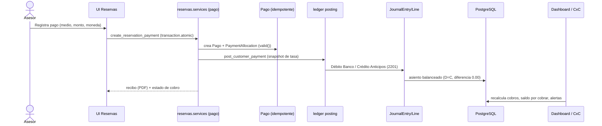
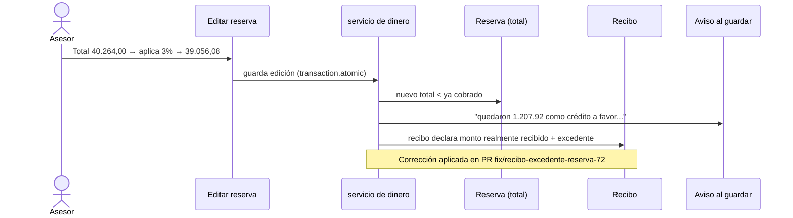
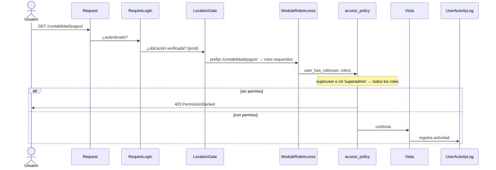
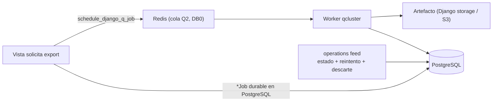

<!-- portfolio-content/omsta/architecture/data-flow.md -->

# Flujos de datos de extremo a extremo — OMSTA

> **Fecha:** 2026-07-21 · **HEAD:** `da5a86b3`
> Flujos reales derivados de servicios y modelos existentes
> (`reservas/services/`, `contabilidad/services/`, `ledger/services/posting.py`,
> `security/`) y del incidente documentado de la reserva #72. No son ejemplos
> inventados.

---

## Flujo 1 — Cobro de una reserva → asiento contable → Cuentas por Cobrar

**Historia:** un asesor cobra una reserva; el pago se valida, se convierte en
asiento de doble partida y actualiza los tableros de cobros y CxC.

Servicios involucrados (verificados en el grafo/baseline):
`reservas.services.reservations.create_reservation_payment` →
`ledger.services.posting.post_customer_payment` (convierte pagos completados en
asientos, aplica conversión de divisas, maneja excedentes como depósitos) →
`reservas.services.payment_health.build_payment_health` (saldos, vencimientos,
alertas) → dashboard / `contabilidad` (CxC).

**Detalle contable real (del incidente #72):** una reserva **no facturada**
registra el cobro completo como **anticipo de clientes** (pasivo, cuenta `2201`),
con débito en `1012` Banco. Al emitir la factura, el sistema **reclasifica**
automáticamente de anticipos a cuentas por cobrar. No hay asiento manual.

---

## Flujo 2 — Descuento sobre una reserva ya pagada → crédito a favor del cliente

**Historia (caso real, reserva #72):** el cliente pagó el total; días después se
aplica un 3 % de descuento. Como el dinero ya estaba en caja, el descuento deja
un **excedente = crédito a favor**. El sistema lo cuenta bien y ahora **avisa**.

**Qué se reparó (evidencia: `docs/incidentes/2026-07-20-reserva-72-excedente.md`):**
1. El descuento se aplicaba "en silencio" → ahora aparece un aviso explícito al
   guardar si el nuevo total queda por debajo de lo ya cobrado.
2. El recibo declaraba menos de lo recibido → ahora muestra el monto real, el
   desglose (aplicado vs excedente) y un bloque "Crédito a favor del cliente".
3. Herramienta de diagnóstico de solo lectura:
   `python manage.py diagnosticar_excedente_reserva <n.º de reserva>`.

Este flujo es la mejor evidencia de **resolución de un problema real de negocio**:
no se "arregló un bug", se corrigió cómo el sistema comunica dinero al usuario.

---

## Flujo 3 — Autenticación → acceso por rol/sucursal/módulo

**Historia:** cada request autenticado pasa por una cadena de middleware que
impone login, ubicación y acceso por módulo antes de llegar a la vista.

Cadena real (`settings.MIDDLEWARE` + `security/`):
`RequireLoginMiddleware` → `LocationVerificationMiddleware` (gate de ubicación,
activo en prod) → `ModuleRoleAccessMiddleware` (403 si el rol no cubre el prefijo
de URL) → `CurrentUserMiddleware` (auditoría) → `ActivityTrackingMiddleware`.

Defensa en profundidad: el middleware **complementa** (no reemplaza) los guards por
vista (`RoleAccessMixin`/`role_required`). La visibilidad de frontend nunca es el
único control.

---

## Flujo 4 (bonus) — Exportación asíncrona con Django Q2

**Historia:** una exportación pesada (p.ej. XLSX de pagos, reporte DGII) no bloquea
el request: se encola y se procesa en el worker, con estado visible en el *tray* de
operaciones.

`operations/lifecycle.py::schedule_django_q_job` centraliza el agendado;
`transaction.on_commit(...)` asegura que el job vea datos ya escritos; el estado
durable vive en PostgreSQL y la experiencia es compartida (no un panel por app).
