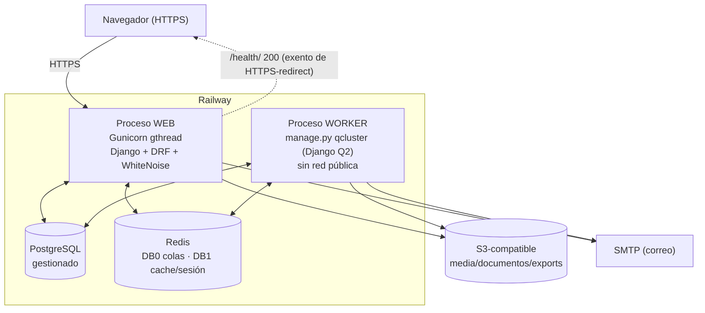

<!-- portfolio-content/omsta/architecture/deployment.md -->

# Despliegue — OMSTA (Railway)

> **Fecha:** 2026-07-21 · **HEAD:** `da5a86b3`
> Fuente: `railpack.json`, `settings.py`, `docs/agents/deployment-checks.md`,
> `COMANDOS_ARRANQUE_CRISTECNO.md`. **No se muestran valores de secretos.**

## 1. Topología en producción

OMSTA se despliega en **Railway** con procesos separados que comparten base de
datos, Redis, secretos y almacenamiento:



## 2. Procesos

### Web (Gunicorn)
Ejemplo de arranque documentado (`docs/agents/deployment-checks.md`):

```bash
gunicorn CristecnoViajes_SRL.wsgi:application \
  --bind 0.0.0.0:$PORT --worker-class gthread \
  --workers ${WEB_CONCURRENCY:-2} --threads ${GUNICORN_THREADS:-4} \
  --timeout 120 --keep-alive 5 \
  --max-requests 800 --max-requests-jitter 100 \
  --access-logfile - --error-logfile -
```
- WhiteNoise sirve estáticos (`CompressedManifestStaticFilesStorage` en prod).
- `SECURE_PROXY_SSL_HEADER` y `USE_X_FORWARDED_HOST` cuando hay proxy inverso
  (`USE_REVERSE_PROXY=True`).

### Worker (Django Q2)
```bash
python manage.py qcluster
```
- No corre Gunicorn ni necesita red pública.
- Comparte DB, Redis, secreto y storage con web.
- No asume disco efímero compartido; no corre migraciones como arranque normal.

## 3. Datos y estado

| Recurso | En producción |
|---|---|
| **PostgreSQL** | Fuente de verdad. `USE_POSTGRES=True`, `CONN_MAX_AGE`, health checks, `sslmode` opcional |
| **Redis** | DB 0 → Django Q2; DB 1 → cache/sesiones (`cached_db`). Configurable por `REDIS_URL`/`DJANGO_Q_REDIS_URL` |
| **Almacenamiento** | `USE_S3_MEDIA=True` → `storages.backends.s3.S3Storage` (endpoint, bucket, región, ACL, querystring auth) |

## 4. Build (railpack) y dependencias del sistema

`railpack.json` instala las libs nativas que WeasyPrint necesita (generación de
PDF): `libglib2.0-0`, `libharfbuzz*`, `libpango-1.0-0`, `libpangoft2-1.0-0`
(en build y deploy).

## 5. Variables de entorno (nombres, **sin valores**)

Configuración por entorno (todas leídas con helpers `env_bool/env_str/env_list`):

- **Núcleo:** `DJANGO_SECRET_KEY`, `DEBUG`, `DJANGO_ALLOWED_HOSTS`,
  `USE_REVERSE_PROXY`, `PUBLIC_SITE_URL`/`SITE_URL`/`BASE_URL`.
- **PostgreSQL:** `USE_POSTGRES`, `POSTGRES_DB/USER/PASSWORD/HOST/PORT`,
  `POSTGRES_SSLMODE`, `POSTGRES_CONN_MAX_AGE`.
- **Redis / Q2:** `USE_REDIS_CACHE`, `REDIS_URL`/`DJANGO_Q_REDIS_URL`,
  `DJANGO_Q_WORKERS`, `DJANGO_Q_TIMEOUT`, `DJANGO_Q_RETRY`, `DJANGO_Q_QUEUE_LIMIT`.
- **Almacenamiento S3:** `USE_S3_MEDIA`, `AWS_ACCESS_KEY_ID`,
  `AWS_SECRET_ACCESS_KEY`, `AWS_STORAGE_BUCKET_NAME`, `AWS_S3_ENDPOINT_URL`,
  `AWS_S3_REGION_NAME`, `AWS_QUERYSTRING_*`.
- **Email:** `EMAIL_BACKEND/HOST/PORT/USE_TLS`, `EMAIL_HOST_USER/PASSWORD`,
  `DEFAULT_FROM_EMAIL`.
- **Seguridad:** `SECURE_SSL_REDIRECT`, `SECURE_HSTS_SECONDS`,
  `SESSION_COOKIE_SECURE`, `CSRF_COOKIE_SECURE`, `LOCATION_GATE_ENABLED`,
  `LOGIN_MAX_ATTEMPTS`, `CSRF_TRUSTED_ORIGINS`.
- **Externos:** `GOOGLE_MAPS_API_KEY`, `IPINFO_TOKEN`.
- **Empresa/fiscal:** `COMPANY_*`, `LEDGER_SUSPENSE_ACCOUNT_CODE`.

## 6. Verificación de despliegue

```bash
python manage.py check
python manage.py makemigrations --check --dry-run
python manage.py migrate
python manage.py collectstatic --noinput
```
Inspección de configuración activa **sin exponer secretos**:
```bash
python manage.py shell -c "from django.conf import settings; \
print('DEBUG=', settings.DEBUG); \
print('DB=', settings.DATABASES['default']['ENGINE']); \
print('SESSION=', settings.SESSION_ENGINE); \
print('S3=', getattr(settings, 'USE_S3_MEDIA', None))"
```
Esperado en prod: `DEBUG=False`, engine PostgreSQL, sesión prevista, storage
consistente con `USE_S3_MEDIA`.

## 7. Seeds y bootstrap (base nueva)

```bash
python manage.py migrate
python manage.py createsuperuser
python manage.py seed_catalogs          # catálogos base
python manage.py ledger_bootstrap       # estructura contable base
```
(Semillas de demostración adicionales: `seed_fx`, `seed_nomina_demo`,
`seed_dgii_606/608/623_demo`, `seed_demo_financial_reporting`, `seed_tutoriales`.)

## 8. Logs y observabilidad

- Logging con handler de archivo rotativo + consola (`logging_utils.py`).
- SQL debug conmutable; loggers específicos por librería (weasyprint, PIL, etc.).
- Auditoría de actividad de usuario en BD (`UserActivityLog`) con retención
  configurable.
- Para latencia alta con DB/Redis ociosos: revisar concurrencia Gunicorn,
  endpoints lentos por access-log, separación web/worker, I/O bloqueante,
  reprogramación de colas, N+1 y contexto de plantillas costoso.

## 9. Backups (nota honesta)

No hay scripts de backup en el repo inspeccionado; en Railway el respaldo de
PostgreSQL depende del proveedor gestionado. **[REQUIERE CONFIRMACIÓN]** la
política real de backups en producción.
