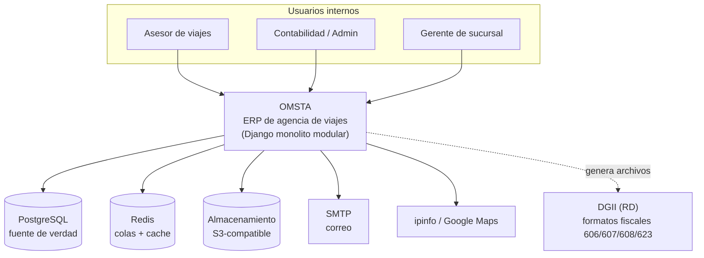
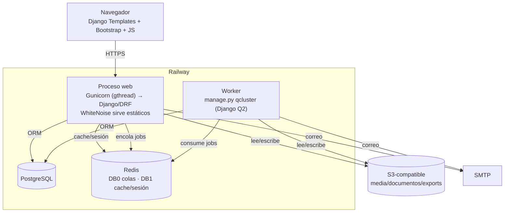

<!-- portfolio-content/omsta/architecture/system-overview.md -->

# Arquitectura general — OMSTA

> **Fecha:** 2026-07-21 · **HEAD:** `da5a86b3`
> Derivado de `settings.py`, `urls.py`, los documentos de arquitectura versionados
> del repo y verificación puntual en código. Toda inferencia se marca como tal.

## 1. Qué es OMSTA

OMSTA (repositorio `CristecnoViajes_SRL`) es un **ERP para una agencia de viajes
en República Dominicana**: un monolito Django modular que integra, en una sola
plataforma, la operación comercial (reservas y CRM), el cobro y la contabilidad
de doble partida, el cumplimiento fiscal dominicano (DGII), la banca, la nómina y
la administración multisucursal.

No es un CRUD: tiene libro mayor real con perfiles de posteo, multimoneda con
snapshots de tasa, idempotencia de pagos, auditoría de actividad y permisos por
rol/sucursal/módulo.

## 2. Componentes principales

| Componente | Responsabilidad |
|---|---|
| **Navegador (UI server-rendered)** | Django Templates + Bootstrap + JS (jQuery/vanilla); formularios dinámicos de reservas y pagos |
| **Aplicación web Django** | 18 apps de dominio; vistas → servicios → modelos; DRF para APIs internas |
| **PostgreSQL** | Fuente de verdad transaccional (reservas, pagos, asientos, nómina, auditoría) |
| **Redis** | Broker de Django Q2 (DB 0) + cache/sesiones (DB 1), con fallback sin Redis |
| **Worker Django Q2 (`qcluster`)** | Trabajos en 2.º plano: exportaciones, avisos, jobs durables por dominio |
| **Almacenamiento S3-compatible** | Media, documentos y exports durables en producción (django-storages/boto3) |
| **Servicios externos** | SMTP (recibos/avisos), ipinfo (geo/IP), Google Maps, formato fiscal DGII |
| **Railway** | Hosting de web + worker + PostgreSQL + Redis |

## 3. Diagrama de contexto (C4 nivel 1)

## 4. Diagrama de contenedores (C4 nivel 2)

## 5. Responsabilidad por capa

- **Presentación (server-rendered):** plantillas base compartidas, navegación,
  formularios con validación de UI **respaldada siempre por validación de servidor**;
  el *tray* de operaciones es UI compartida (no se duplica por app).
- **Aplicación (vistas/DRF):** orquestación ligera; las vistas de detalle actúan
  como despachadores hacia servicios.
- **Servicios/selectores:** lógica de negocio de alto riesgo (pagos, posteo, notas,
  planes de pago, salud de pagos) en funciones explícitas y atómicas
  (`transaction.atomic()`, `select_for_update()` donde hay concurrencia).
- **Dominio (modelos):** agregados por app; `Reserva` y `Pago` son el núcleo
  transaccional.
- **Datos:** PostgreSQL autoritativo; Redis nunca guarda estado de negocio.
- **Transversal:** middleware de seguridad (login obligatorio, gate de ubicación,
  acceso por módulo/rol), auditoría de actividad, usuario actual para auditoría.

## 6. Decisiones importantes (verificadas)

1. **PostgreSQL como única fuente de verdad**; SQLite solo como fallback local.
2. **Django Q2 en vez de Celery** (regla explícita del repo; Celery figura en
   requirements pero no se importa — deuda a retirar).
3. **Servicios explícitos para el dinero**: el posteo contable, los pagos y las
   notas viven fuera de vistas y plantillas.
4. **Contabilidad de doble partida con `ledger` como "hoja" neutral**: el motor de
   posteo por documento vive en `contabilidad/services/posting/`; `ledger` define
   el contrato (`source_registry.py`) y guarda asientos.
5. **Seguridad de lado servidor por defecto**: la visibilidad de frontend nunca es
   el único control; permisos por usuario/rol/sucursal/módulo/propiedad.
6. **Almacenamiento durable desacoplado del disco local**: web y worker no
   comparten disco efímero; media/exports por Django storage (S3 en prod).

## 7. Límites conocidos (honestos, del propio análisis del repo)

- **Concentración de masa:** `contabilidad` + `reservas` son ~51 % del código;
  `Reserva` (52 métodos) y `Pago` (32) concentran lógica → cambios de alto riesgo.
- **Vistas/métodos gigantes:** `reservas_home` (683 líneas) y
  `CuentasPorPagarView.get_context_data` (766) son deuda concreta priorizada.
- **`operations` como "hub invertido":** la capa de procesos importa de ~7 apps de
  dominio; se plantea invertir con un registro de proveedores.
- **Frontend con menor red de pruebas** que el backend (155 archivos JS; solo parte
  con Jest).
- **[INFERENCIA]** La arquitectura es sólida para seguir como monolito modular; no
  requiere microservicios.
